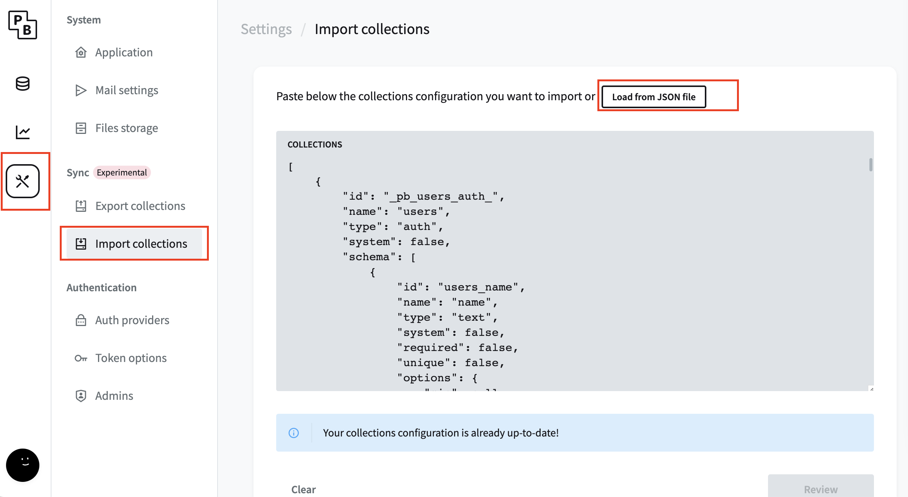
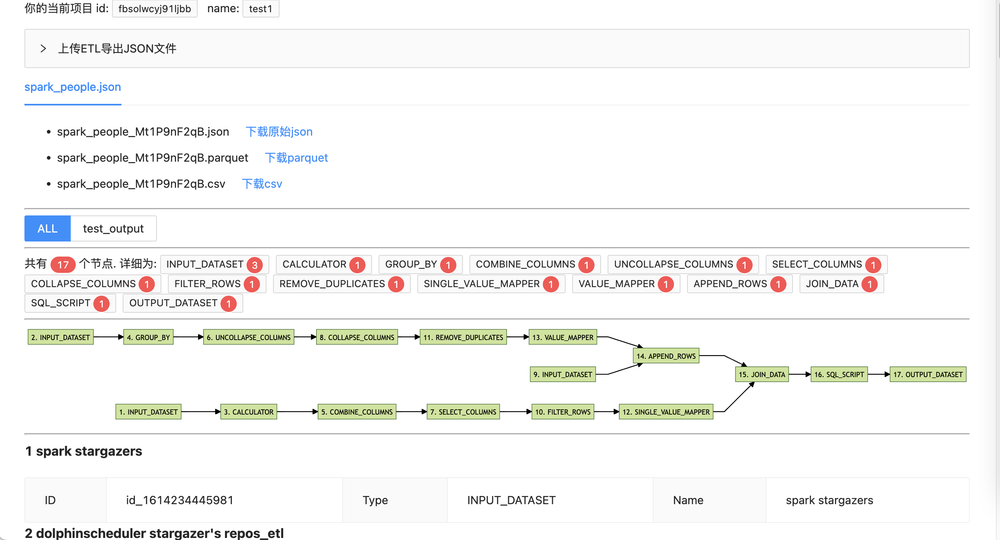

# guantool

guantool by 观远数据. 一系列小工具来辅助理解观远BI中的各种模型, 比如: ETL, 页面(coming soon)


# 使用说明


## 当前支持操作系统

目前支持 Linux 和 MacOS.


## 安装步骤1: 下载并运行

从 <https://github.com/GuandataOSS/guantool/releases/> 下载最新的版本. guantool.tar.gz

这个压缩包中同时包含了 Linux 和 MacOS 的可执行程序

解压该 tar.gz 文件到目标目录.

```bash
tar -xf guantool.tar.gz
```

进入 guantool 目录. 运行: ./run.sh 即可启动服务, 默认run.sh的内容如下:

```text
./guan-tools-`uname` serve --http 0.0.0.0:8090 --dir ../pb_data
```

根据操作系统的不同, 会选择 guan-tools-Darwin 或 guan-tools-Linux,

-   然后默认启动的端口是: 0.0.0.0:8090 如果只想在本机访问可以改为: 127.0.0.1:8090
-   数据将存储在和 guantool 目录同级的 pb\_data 目录(会自动创建), 注意: guantool产生的数据都在pb\_data目录, 请做好备份


## 安装步骤2: 登录管理界面, 并导入guantool依赖的表(collections)

guantool本身是基于"低代码"项目: <https://github.com/pocketbase/pocketbase> 所以, 第一步先浏览器访问:

<http://127.0.0.1:8090/_/>

创建一个管理员账号(需要输入邮箱和密码), 请牢记这个用户名和密码

然后在"Import Collections"导入 guantool\_schema.json 文件.



导入后, 可以检查一下 Collections 下是否出现了 "project" 和 "etl\_file" 两个Collections (Tables), 这里会存储 guantool etl解析功能的元数据.

然后就可以访问 <http://127.0.0.1:8090/> 来使用本工具了. 项目名称可以随便新建一个, 然后上传观远BI的ETL导出的JSON文件. 比如本目录下的 example\_simple\_etl.json 文件.



Have Fun!